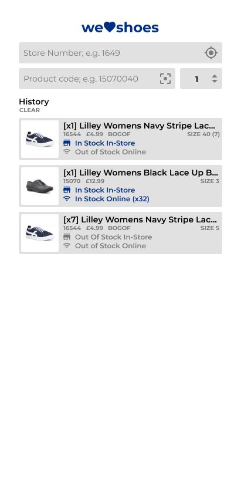
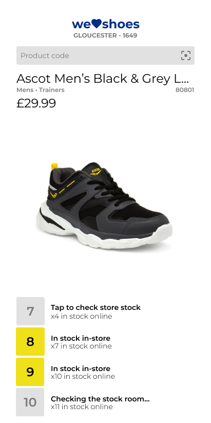

    

# we:heart:shoes
A sample app for my portfolio using live data from [Shoe Zone's](https://shoezone.com) website.

View the live app at: https://clockworksquirrel.github.io/we-heart-shoes-staff-pwa

## About
**we:heart:shoes** is a web application designed as a demo for my personal portfolio. It is designed to enabled Shoe Zone staff to perform instant stock enquiries without the use of the till.

we:heart:shoes is built using [React](https://github.com/facebook/react/) on the client side (with customised core components provided by [Material-UI](https://github.com/mui-org/material-ui)), and [Express](https://github.com/expressjs/express) on the server (hosted on [RunKit](https://runkit.com)). The client app uses the current device's geolocation in order to locate the user's nearest store. This then allows the app to check the store's stock levels.

## Draft Designs
### First Draft
| Home                                   |
|----------------------------------------|
|  |

### Final Draft
| Home                             |                        Product Details |
|----------------------------------|----------------------------------------|
|  |  |

## Additional Resources
### REST API
The REST API is hosted on RunKit and performs core functionality for the client, such as locating the user's nearest store, retrieving product details, and checking a store's stock levels.

**The source code for the server can be found here:**
https://runkit.com/clockworksquirrel/5eff1349ea0eb3001a60af53

**The public API is hosted at:**
https://untitled-bzxwlvj4h4dk.runkit.sh/

### Frameworks
* React - https://github.com/facebook/react/
* Express - https://github.com/expressjs/express
* RunKit - https://runkit.com
* Material-UI - https://github.com/mui-org/material-ui
